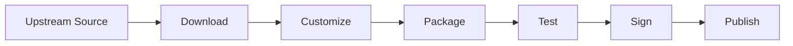

# KubeVirt Machine Images (KMI)

Production-ready virtual machine disk images for KubeVirt, distributed as OCI container images.

## Overview

KMI provides curated, automatically updated VM disk images for running virtual machines on
Kubernetes with KubeVirt. Each image is built from official upstream sources, customized for cloud
environments, packaged as an OCI container image, and published to Docker Hub for easy consumption.

**Key Features:**

- 🔄 **Automated Updates** - Weekly builds ensure images include latest security patches
- 📦 **OCI Distribution** - Standard container registries for caching, mirroring, and air-gapped
  environments
- 🔐 **Signed & Verified** - All images signed with Cosign for supply chain security
- 🏗️ **Multi-Architecture** - Native amd64 and arm64 support where upstream provides
- ☁️ **Cloud-Ready** - Pre-configured with cloud-init and qemu-guest-agent
- 🧪 **Tested** - Automated testing validates boot, guest agent, and SSH connectivity

## Quick Start

Deploy a Fedora VM on your KubeVirt cluster:

```yaml
apiVersion: kubevirt.io/v1
kind: VirtualMachine
metadata:
  name: fedora-vm
spec:
  running: true
  template:
    spec:
      domain:
        devices:
          disks:
            - name: containerdisk
              disk:
                bus: virtio
            - name: cloudinitdisk
              disk:
                bus: virtio
        resources:
          requests:
            memory: 2Gi
            cpu: 2
      volumes:
        - name: containerdisk
          containerDisk:
            image: docker.io/containercraft/fedora:42
        - name: cloudinitdisk
          cloudInitNoCloud:
            userData: |
              #cloud-config
              password: fedora
              chpasswd: { expire: False }
```

## Available Images

| Distribution            | Version     | Status  | amd64 | arm64 | Image                                |
| :---------------------- | :---------- | :------ | :---: | :---: | :----------------------------------- |
| **AlmaLinux**           | 10          | Preview |  ✅   |  ✅   | `containercraft/almalinux:10`        |
| **Arch Linux**          | Latest      | Preview |  ✅   |  ❌   | `containercraft/archlinux:latest`    |
| **CentOS Stream**       | 10          | Preview |  ✅   |  ✅   | `containercraft/centos:10`           |
| **Debian**              | 13 (Trixie) | Preview |  ✅   |  ✅   | `containercraft/debian:13`           |
| **Fedora**              | 42          | Preview |  ✅   |  ✅   | `containercraft/fedora:42`           |
| **Fedora CoreOS**       | 42          | Preview |  ✅   |  ✅   | `containercraft/fcos:42`             |
| **FreeBSD**             | 15 Beta 2   | Preview |  ✅   |  ✅   | `containercraft/freebsd:15`          |
| **openSUSE Leap**       | 16          | Preview |  ✅   |  ✅   | `containercraft/opensuse:leap-16`    |
| **openSUSE Tumbleweed** | Rolling     | Preview |  ✅   |  ❌   | `containercraft/opensuse:tumbleweed` |
| **OpenWrt**             | 24          | Preview |  ✅   |  ✅   | `containercraft/openwrt:24`          |
| **Rocky Linux**         | 10          | Preview |  ✅   |  ✅   | `containercraft/rocky:10`            |
| **Talos Linux**         | 1.11        | Preview |  ✅   |  ✅   | `containercraft/talos:1-11`          |
| **Ubuntu**              | 24.04       | Preview |  ✅   |  ✅   | `containercraft/ubuntu:24-04`        |
| **VyOS**                | Rolling     | Preview |  ✅   |  ❌   | `containercraft/vyos:rolling`        |

**Planned:**

- Amazon Linux
- Neutrino (ContainerCraft minimal OS)

> **Note:** All images are in Preview status while we finalize testing and promotion workflows.

## How It Works

### Build Pipeline



1. **Download** - Fetch official qcow2 images from upstream distribution mirrors
2. **Customize** - Use libguestfs to inject cloud-init, qemu-guest-agent, and standard tooling
3. **Package** - Wrap qcow2 disk in minimal OCI container (UBI Micro base)
4. **Test** - Boot on KubeVirt, validate guest agent and SSH connectivity
5. **Sign** - Generate Cosign signature for supply chain verification
6. **Publish** - Push to Docker Hub with semantic version tags

### Architecture

```
kmi/
├── images/               # Image definitions
│   └── <flavor>/
│       ├── env.sh        # Build configuration (URLs, checksums, arch)
│       └── virt.sysprep  # Customization script (packages, configs)
├── hack/
│   ├── customize.sh      # Main build script (libguestfs)
│   └── update.sh         # Checksum updater for rolling releases
├── tests/                # BATS test suite
├── bake.hcl              # Docker Buildx multi-arch configuration
└── Containerfile         # OCI image wrapper
```

**CI/CD:**

- **CircleCI** - Builds qcow2 images on amd64/arm64 runners with large resource classes
- **GitHub Actions** - Tests images on kind with KubeVirt, promotes to production tags

### Special Build Methods

**Standard** (Most distributions):

1. Download compressed qcow2 from upstream
2. Verify checksum
3. Extract and customize with virt-sysprep
4. Sparsify to reduce image size
5. Package in OCI image

**VyOS** (Build from source):

1. Clone vyos-build repository
2. Build using official vyos-build container
3. Extract generated qcow2
4. Package without modification (no virt-sysprep)

**Talos Linux** (Image Factory):

1. Download pre-built qcow2 from Talos Image Factory
2. Package without modification (immutable OS)
3. Skip SSH testing (Talos uses talosctl/gRPC API)

## Usage Examples

### Basic VM with Cloud-Init

```yaml
apiVersion: kubevirt.io/v1
kind: VirtualMachine
metadata:
  name: ubuntu-vm
spec:
  running: true
  template:
    spec:
      domain:
        cpu:
          cores: 2
        memory:
          guest: 4Gi
        devices:
          disks:
            - name: containerdisk
              disk:
                bus: virtio
            - name: cloudinitdisk
              disk:
                bus: virtio
      volumes:
        - name: containerdisk
          containerDisk:
            image: docker.io/containercraft/ubuntu:24-04
        - name: cloudinitdisk
          cloudInitNoCloud:
            userData: |
              #cloud-config
              users:
                - name: ubuntu
                  sudo: ALL=(ALL) NOPASSWD:ALL
                  ssh_authorized_keys:
                    - ssh-rsa AAAAB3NzaC1yc2E...
```

### Router VM with Multus (VyOS Example)

See [examples/vyos-basic/](examples/vyos-basic/) for a complete VyOS router setup with dual Multus
bridge interfaces (WAN/LAN).

### Talos Kubernetes Node

```yaml
apiVersion: kubevirt.io/v1
kind: VirtualMachine
metadata:
  name: talos-node
spec:
  running: true
  template:
    spec:
      domain:
        cpu:
          cores: 4
        memory:
          guest: 8Gi
        devices:
          disks:
            - name: containerdisk
              disk:
                bus: virtio
      volumes:
        - name: containerdisk
          containerDisk:
            image: docker.io/containercraft/talos:1-11
```

> **Note:** Talos requires `talosctl` for configuration and management (no SSH).

## Contributing

### Adding a New Distribution

1. **Create image directory:**

   ```bash
   mkdir -p images/<distribution-name>/
   ```

2. **Create `env.sh`** with build configuration:

   ```bash
   # Architecture-specific variables
   _ARCH=$(echo ${ARCH} | sed 's/amd64/x86_64/;s/arm64/aarch64/')

   # Download URLs
   BASE_URL=https://example.org/images/
   DOWNLOAD_FILE=example-cloud.qcow2

   # Checksums
   AMD64_SHA256SUM=abc123...
   ARM64_SHA256SUM=def456...

   # Optional: Skip tests
   SKIP=ssh

   # Optional: Disable customization for immutable images
   CUSTOMIZE=false
   SPARSIFY=false
   ```

3. **Create `virt.sysprep`** with customization commands:

   ```bash
   install git,vim,tmux,qemu-guest-agent
   run-command systemctl enable qemu-guest-agent
   ```

4. **Add to `bake.hcl`:**

   ```hcl
   target "distribution-version" {
     inherits = ["defaults"]
     platforms = ["linux/amd64", "linux/arm64"]
     tags = [
       tag("distribution", "version"),
       tag("distribution", "latest"),
     ]
     args = {
       FLAVOR = "distribution-version"
     }
   }
   ```

5. **Add to CircleCI** (`.circleci/config.yml`):

   ```yaml
   aliases:
     distribution-flavors: &_distribution-flavors
       - distribution-version

   workflows:
     build-and-publish-dev:
       jobs:
         - customize:
             matrix:
               parameters:
                 flavor: *_distribution-flavors
                 arch: [amd64, arm64]
         - cradle:
             requires:
               - customize-<< matrix.flavor >>-amd64
               - customize-<< matrix.flavor >>-arm64
             matrix:
               parameters:
                 flavor: *_distribution-flavors
   ```

6. **Test locally:**

   ```bash
   FLAVOR=distribution-version ARCH=amd64 bash hack/customize.sh
   docker buildx bake distribution-version --load
   ```

7. **Submit PR** with your changes

### Development Workflow

```bash
# Test customization script
FLAVOR=ubuntu-24-04 ARCH=amd64 bash hack/customize.sh

# Build OCI image locally
docker buildx bake ubuntu-24-04 --load

# Test with KubeVirt
kubectl apply -f tests/vmi.yaml

# Run test suite
FLAVOR=ubuntu-24-04 bats tests/run.bats
```

### Testing

Images are tested automatically on every build:

1. **Pod Ready** - VM pod reaches Ready state
2. **Guest Agent** - qemu-guest-agent responds via virtctl
3. **SSH Access** - Public key authentication succeeds (skipped for Talos/OpenWrt)

Skip SSH test for distributions without SSH by default:

```bash
SKIP=ssh
```

## Architecture Support

**Native multi-arch** (amd64 + arm64):

- AlmaLinux, CentOS, Debian, Fedora, FCOS, FreeBSD, openSUSE Leap, OpenWrt, Rocky, Talos, Ubuntu

**amd64 only** (upstream limitation):

- Arch Linux, openSUSE Tumbleweed, VyOS

**Planned arm64 support:**

- VyOS (waiting for upstream arm64 builds)

## Security

### Image Signing

All production images are signed with [Cosign](https://github.com/sigstore/cosign):

```bash
# Verify image signature
cosign verify docker.io/containercraft/ubuntu:24-04 \
  --certificate-identity-regexp='https://github.com/ContainerCraft/kmi/.*' \
  --certificate-oidc-issuer=https://token.actions.githubusercontent.com
```

### Supply Chain

- **Checksums** - All downloads verified against upstream SHA256/SHA512
- **Reproducible** - Builds use pinned versions and checksums
- **Signed** - Sigstore keyless signing with GitHub OIDC
- **Transparent** - Full build logs available in CI

## FAQ

**Q: Why use OCI images for VM disks?** A: Container registries provide caching, mirroring, and
air-gapped support. Images can be pre-pulled to nodes and version-pinned for production stability.

**Q: Can I use these with standalone QEMU/KVM?** A: Yes! Extract the qcow2 from the OCI image:

```bash
docker create --name tmp containercraft/ubuntu:24-04
docker cp tmp:/disk/ubuntu-24-04.qcow2 ./ubuntu.qcow2
docker rm tmp
```

**Q: How do I pin to a specific build?** A: Use image digest instead of tag:

```yaml
image: docker.io/containercraft/ubuntu@sha256:abc123...
```

**Q: What's the difference between Preview and Stable?** A: Preview images boot successfully but may
have incomplete testing or customization. Stable images meet all criteria in our
[original README](README.md#stable) including metadata, testing, and documentation.

**Q: Do images include proprietary drivers?** A: No. Images use only upstream packages. Install
proprietary drivers post-boot via cloud-init if needed.

## License

This project is licensed under GPLv3. See [LICENSE](LICENSE) for details.

All packaged distributions retain their original licenses:

- AlmaLinux: BSD-3-Clause
- Arch Linux: Multiple (see [Arch Linux Licensing](https://wiki.archlinux.org/title/Licenses))
- CentOS: Multiple open-source licenses
- Debian: DFSG-compliant licenses
- Fedora: Multiple open-source licenses
- FreeBSD: BSD-2-Clause
- openSUSE: Multiple open-source licenses
- OpenWrt: GPL-2.0
- Rocky Linux: BSD-3-Clause
- Talos: MPL-2.0
- Ubuntu: Mixed (mostly GPL/Apache/BSD)
- VyOS: GPL-3.0

## Support

- **Issues**: [GitHub Issues](https://github.com/ContainerCraft/kmi/issues)
- **Discussions**: [GitHub Discussions](https://github.com/ContainerCraft/kmi/discussions)
- **Contributing**: See [CONTRIBUTING.md](CONTRIBUTING.md) (coming soon)

## Acknowledgments

Built with:

- [KubeVirt](https://kubevirt.io) - Virtual machines on Kubernetes
- [libguestfs](https://libguestfs.org) - VM disk image modification
- [Docker Buildx](https://github.com/docker/buildx) - Multi-architecture builds
- [Cosign](https://github.com/sigstore/cosign) - Container signing and verification
- [CircleCI](https://circleci.com) - CI/CD platform

Special thanks to all upstream distribution maintainers for providing official cloud images.

---

**ContainerCraft** | [Website](https://containercraft.io) |
[GitHub](https://github.com/ContainerCraft)
